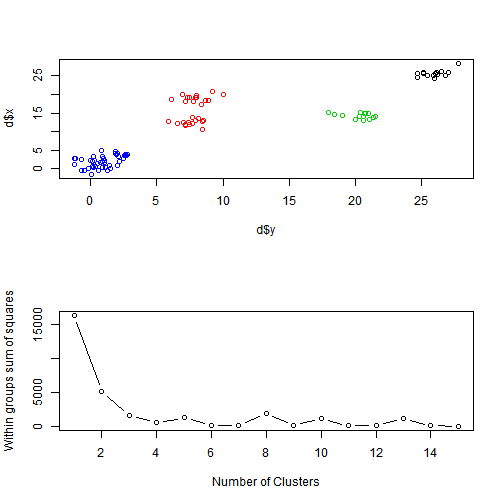

## Problem
A problem when working with clustering methods can be to visualize how a specific clustering method works on a given dataset.
The K-means explorer will address this problem.

--- 

## Proposed solution

The K-means explorer visualizes how the K-mean clustering algorithm works on a randomized set of data.
The user can 

<ol>
        <li>select a random seed to generate data</li>
        <li>select how many clusters to generate</li>
        <li>visualize the clusters</li>
</ol>

---

## K-mean Explorer

In the example below a user has selected a seed of 7 to generate random data. He selects 4 clusters and will get an immediate visualization of the clusters.

 

---

## Feedback

The app can be tried out on shinyapps:
https://abbhakan.shinyapps.io/Kmean-Explorer/

Any questions or suggestions may be directed to abbhakan 'at' gmail.com.

---

